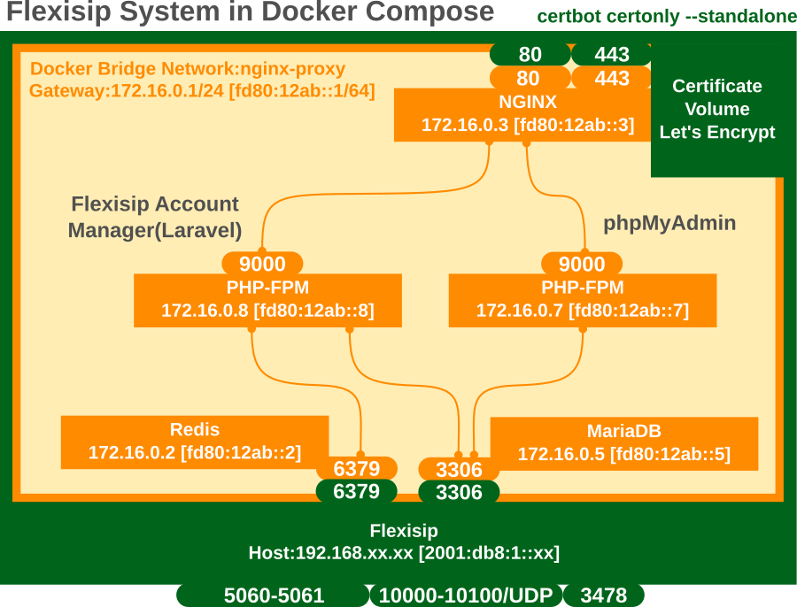

# Flexisip server with flexisip-account-manager on ubuntu 22.04 by docker compose file

Confirmed runnning flexisip proxy, conference(only group chat), presence server and the flexisip account manager with IPv6 and IPv4 addresses.

The attched files may be used only for the purpose of reference. You should have to edit the following related files for running on your machine.

**Files** 
* `ubuntu22-04/redis/redis.conf`
* `ubuntu22-04/flexisip_conf/flexisip.conf`
* `ubuntu22-04/.env (for docker compose file)`
* `ubuntu22-04/flexisip-account-manager/.env (flexisip-account-manager,Laravel)`
* `ubuntu22-04/nginx/nginx.conf`



## Make flexisip docker image on ubuntu 22.04

```
$ cd docker
$ make flexisip-ubuntu-deb-build
```

**Sample config file**
`docker/flexisip.conf.sample`


## Certbot Let's Encrypt certification

Create the following cert files by docker_hub certbot/certbot:`https://hub.docker.com/r/certbot/certbot`.

```
$ docker run -it --rm --name certbot -v "$PWD/letsencrypt:/etc/letsencrypt" -p 80:80 certbot/certbot certonly --standalone -d www.example.com
```

Add the below cronjob into the host crontab.
```
$ docker run -it --rm --name certbot -v "/??/??/.../letsencrypt:/etc/letsencrypt" -p 80:80 certbot/certbot renew
```

## Redis

Need to download default config file:redis.conf from `https://redis.io/topics/config`.
Then modify it to enable the auth access(password), and input it into `/etc/redis` directory.

**WARNING** If you got the low memory condition issue, 
To fix this, add 'vm.overcommit_memory = 1' to `/etc/sysctl.conf` and then reboot
or rebuild redis new image with overwriting `sysctl.conf`.

## Download flexisip-account-manager from github or gitlab
```
$ git clone https://gitlab.linphone.org/BC/public/flexisip-account-manager.git
```

## Execute docker compose 

```
$ cd ubuntu22-04
$ docker compose up -d 
```

## Reference

**Flexisip**
https://github.com/BelledonneCommunications/flexisip

**flexisip-account-manager**
https://gitlab.linphone.org/BC/public/flexisip-account-manager

**Ficusonline Forum(only Japanese)**
https://ficus-forum.myvnc.com/t/topic/479/15

