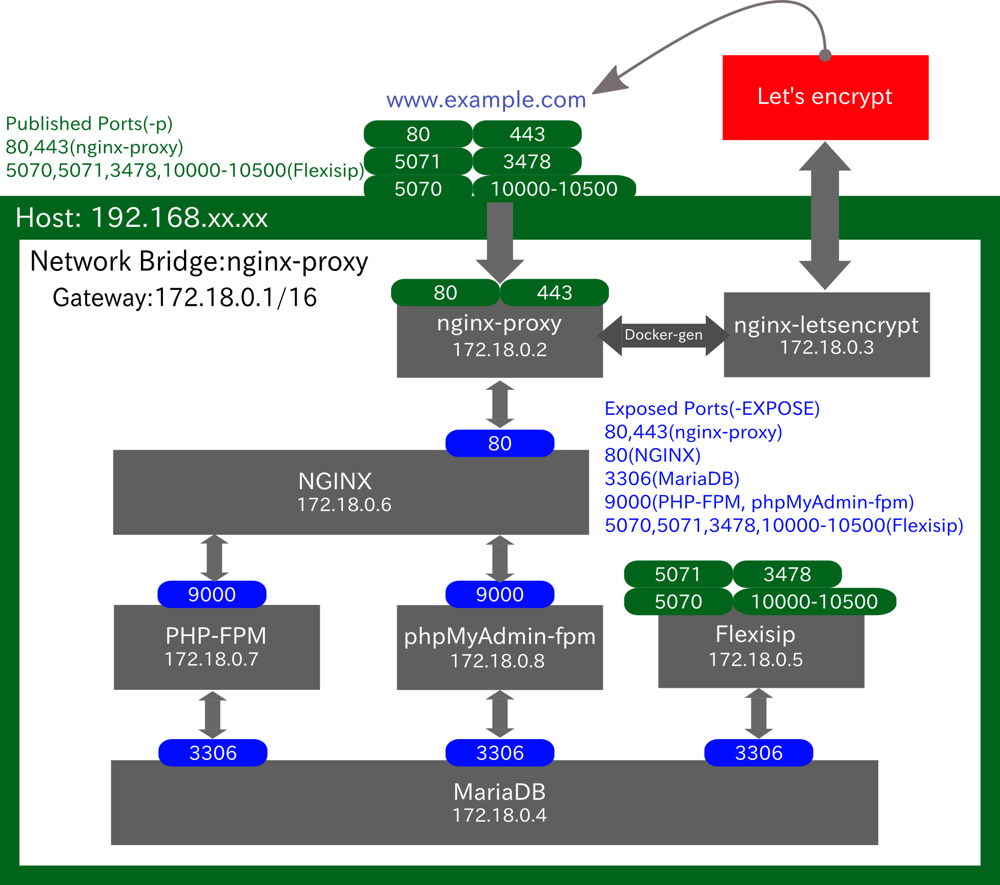

# Dockerfile to build the docker image of flexisip for Ubuntu 18.04 and Debian 9 Stretch 



**How to build the Docker image of flexisip from the Dockerfile**

***debian image***

```
$ cd debian
$ sudo make flexisip-deb-build
```
***ubuntu image***

```
$ cd nginx+letsencrypt_ver3
$ docker-compose up -f nginx-lets.yml -d
$ cd ..
$ cd docker-compose-ubuntu
$ sudo make flexisip-ubuntu-build
$ docker-compose up -d
```

***Run docker container***

```
$ docker run -dti --network host --name Container_Name [REPOSITORY:TAG or IMAGE_ID]
```
#
# Run docker container with other containers(MariaDB) by docker-compose file under nginx-proxy

**STEP 1 - Run enginx-proxy container**
```
$ docker run --detach \
    --name nginx-proxy \
    --publish 80:80 \
    --publish 443:443 \
    --volume /etc/nginx/certs \
    --volume /etc/nginx/vhost.d \
    --volume /usr/share/nginx/html \
    --volume /var/run/docker.sock:/tmp/docker.sock:ro \
    jwilder/nginx-proxy
```
**STEP 2 - letsencrypt-nginx-proxy-companion**
```
$ docker run --detach \
    --name nginx-proxy-letsencrypt \
    --volumes-from nginx-proxy \
    --volume /var/run/docker.sock:/var/run/docker.sock:ro \
    --env "DEFAULT_EMAIL=mail@yourdomain.tld" \
    jrcs/letsencrypt-nginx-proxy-companion
```

**Step 3 - proxyed container(s)**

**In the folder docker-compose file exists**

```
$ docker-compose up -d
```
#
**Confirm docker container network**
```
$ docker network inspect nginx-proxy
```

#
**Go into the container**
```
$ docker exec -ti Container_Name bash
```

**If you need snmp, implement the following command inside the container:**
```
# /etc/init.d/snmpd start
```
**Or restart the container with the exec command**
```
$ docker container restart Container_Name && docker exec -it Container_Name /etc/init.d/snmpd start

```

**Show flexisip version and compiled options**
``` 
/opt/belledonne-communications# flexisip -v

flexisip  version: 1.0.13 (git: 1.0.13-256-gd3c516aa)
sofia-sip version 1.13.35bc

Compiled with:
- SNMP
- Transcoder
- Redis
- Soci
- Protobuf
- Presence
- Conference

```

**Reference** 

Flexisip
https://github.com/BelledonneCommunications/flexisip

nginx-proxy
https://github.com/jwilder/nginx-proxy

LetsEncrypt companion container for nginx-proxy
https://github.com/JrCs/docker-letsencrypt-nginx-proxy-companion

Also please check my homepage(flexisip.conf, database table and so on)
https://ficus.myvnc.com
